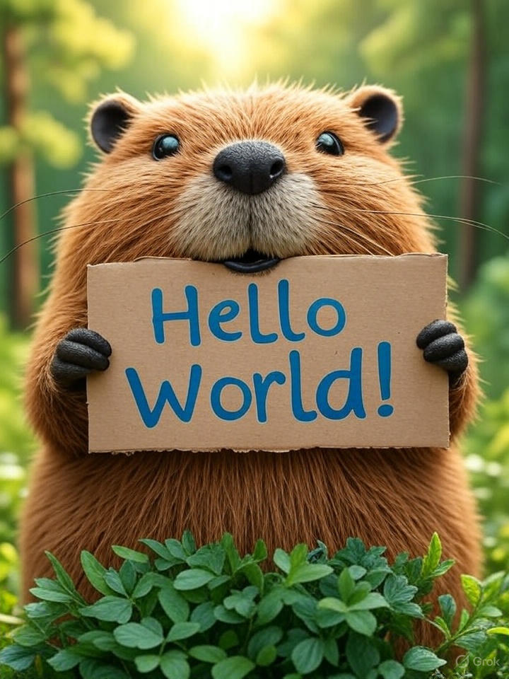
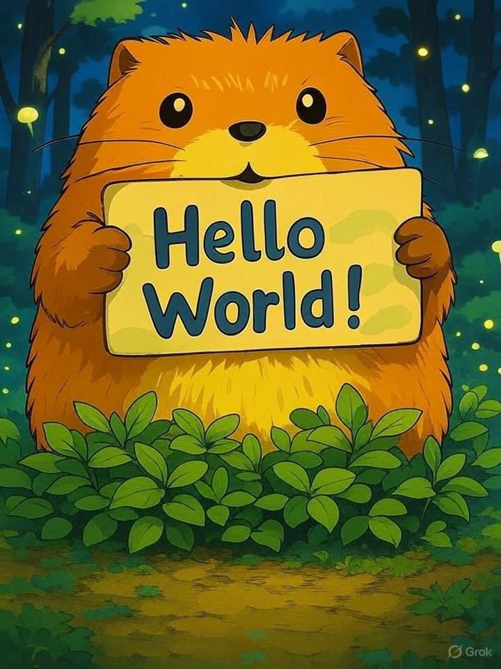


*Generate an image where "A close-up photo of a cute beaver holding a cardboard sign that says 'Hello World!' in blue writing. The background is a blurry green forest."*


ai_work
grok
jpeg

ai_work
grok
jpeg
ghibli

ai_work
gemini


*Generate an image where "A close-up photo of a cute beaver holding a cardboard sign that says 'MySeq' in blue writing. The background is a blurry green forest."*


ai_work
gemini

> I like the images generated with **Gemini** and **Grok**.
> Because it has the <mark>Grok</mark> and <mark>ai</mark> watermarks at the bottom right cornera.

