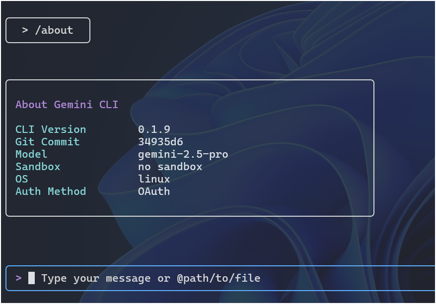
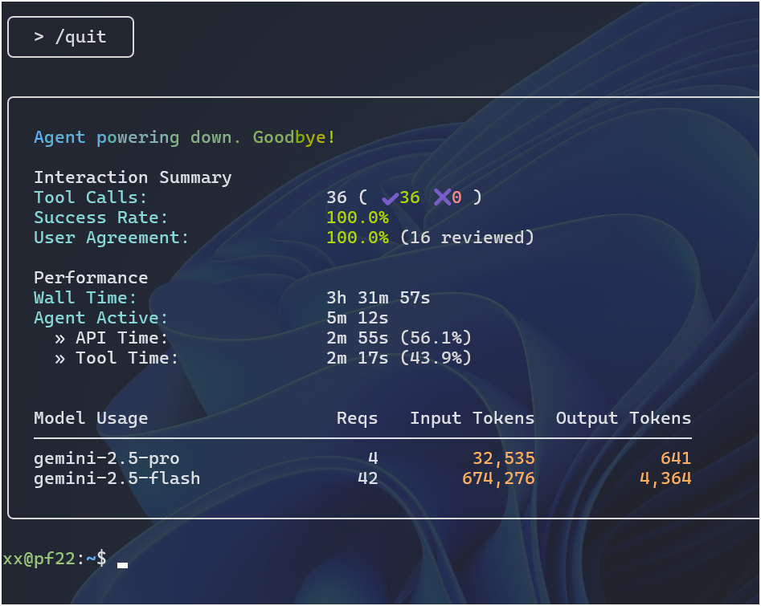


*I like* ***Gemini CLI*** *AI agent because:*
  - *it is open-source and has* ***cli interface***
  - *it supports 60 request/min and 1K request/day*
  - *it shares technology with Gemini Code Assist*



Just follow the quickstart guide at the GitHub repo: [Gemini CLI](https://github.com/google-gemini/gemini-cli).
I just install the *command-line AI workflow tool* from **Google**.

## Quickstart

Here's my setup:

 1. Setup Node.js[^1] (> v18.x).
 1. Install Gemini-CLI with `npm`.
 1. Simply start with `gemini`.
 1. Pick `Ayu Light` theme.
 1. Select `Login with Google` authenticate mode.

[^1]: [NodeJS 101](/posts/nodejs101/)

## Show Version

At the cmdline, we can check the gemini-cli version:

```console
xx@pf22:~$ gemini -v
0.1.9
```

Or, in the gemini app, we can type `/about` to have the about screen.




## Show Help

At the prompt, simply `/help` will show the help screen commands.
Here's the list of commands:

```console
Commands:
  /help - for help on gemini-cli
  /docs - open full Gemini CLI documentation in your browser
  /clear - clear the screen and conversation history       
  /theme - change the theme                               
  /auth - change the auth method                         
  /editor - set external editor preference              
  /privacy - display the privacy notice               
  /stats - check session stats. Usage: /stats [model|tools]
  /mcp - list configured MCP servers and tools            
  /memory - manage memory. Usage: /memory <show|refresh|add> [text for add] 
  /tools - list available Gemini CLI tools   
  /about - show version info                
  /bug - submit a bug report               
  /chat - Manage conversation history. Usage: /chat <list|save|resume> [tag] 
  /quit - exit the cli                             
  /compress - Compresses the context by replacing it with a summary. 
  ! - shell command                           
```

## Logout/Quit

To exit the app, type `/quit`.



## Links 

 - GitHub repo: [Gemini CLI](https://github.com/google-gemini/gemini-cli)
 
 - Google Blog: [Gemini CLI: your open-source AI agent](https://blog.google/technology/developers/introducing-gemini-cli-open-source-ai-agent/)


## Update (7/7/2025)

Here's a 2-min introduction on **Gemini-CLI**.
It comes with:
 
 - free usage limits: Gemini 2.5 Pro with 1 million token context window
 - 1K requests per day
 - open source




