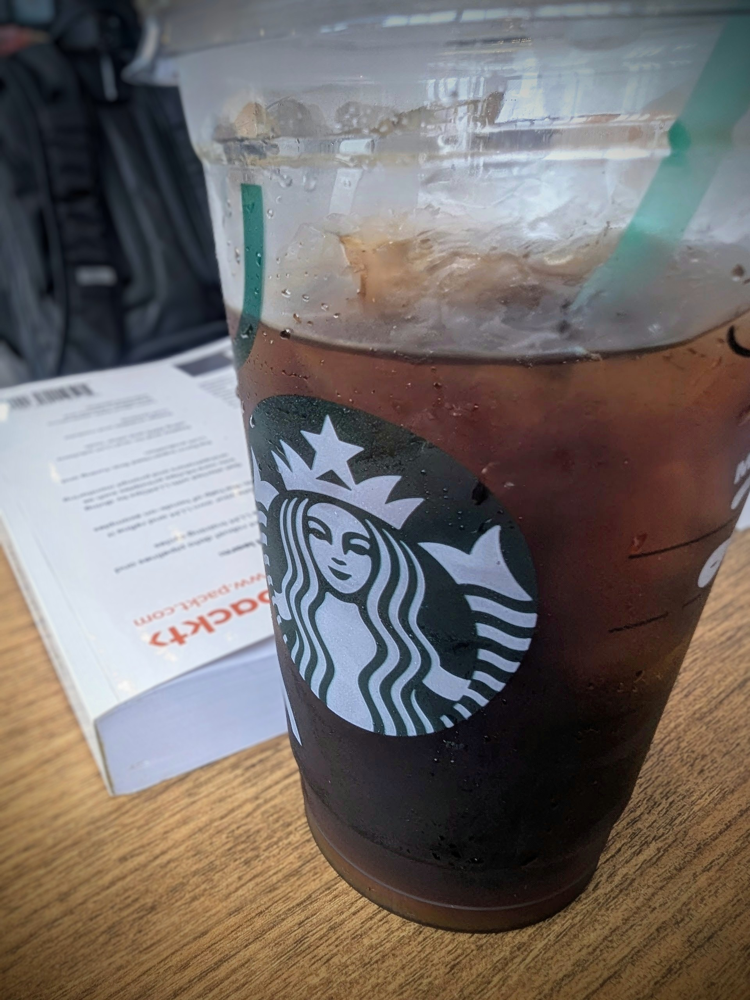


*My reading starts at Starbucks...* 🗽


<!--

  
  

-->

## Chapter-1

This book, ***LLM Engineer's Handbook***, begins with the *why* building an LLM Twin. 
And this is the ultimate goal of this book. 

Then it continues by introducing **MVP** (minimum viable product) which is *what* features will be delivered.
This is a powerful strategy, and the key is, ***sticking to the `V`*** in MVP.

Last, it introduces the solution -- **ML pipelines** for ML systems.
It is based on the **FTI** (feature, training, inference) pattern. 

This is the most valuable concept I learn in chapter-1.

> Imagine this, with FTI, I can start explore into Google Cloud architecture document.

The **FTI pipelines** act as logical layers to interact with each other through the feature store and model registries.
It is a tool used to clarify how to design ML systems.

This shows how FTI pattern has been applied to design the architecture of a ML system (LLM Twin).

> Excellent job! From **why** to **what**, and from **what** to **how**.
> And I repeat this chapter *twice*.

## Chapter-2 

Chapter-2 begins with preparing the Python ecosystem and project installation. 
This makes me wonder should I switch from `uv` to `poetry` for the sake of *convenient*.

> The author does mentioned `uv` in the book, but ...

Then, this chapter has introduced the following for the rest of the chapter-2:

 - MLOps and LLMOps
 - model registry
 - ZenML for orchestrator, artifacts, and metadata
 - NoSQL database (MongoDB) for storing unstructured and vector data

> OK, I just stop here and continue enjoy my beverage ...

