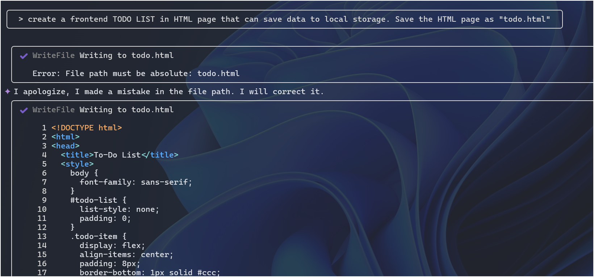
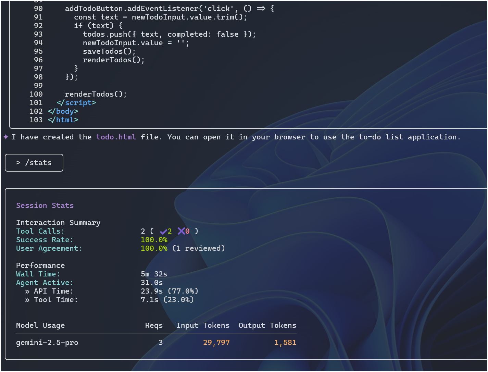
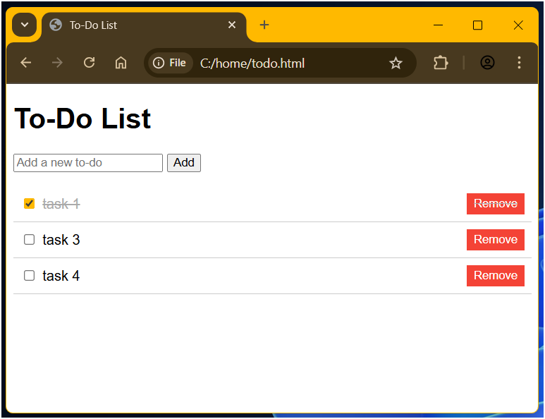


*This is the first attempt to create a frontend HTML page with Gemini-cli.*




## Quickstart

Start `gemini`, and type the following in the prompt.

`> create a frontend TODO LIST in HTML page that can save data to local storage. Save the HTML page as "todo.html"`

At first, it made a mistake.
But it has corrected it automatic.

Below is the screenshot.

At the end, it creates the `todo.html` file.

I use `/stats` to show how fast it completes the job.

## Demo 

Here is the demo of the `todo.html`.

